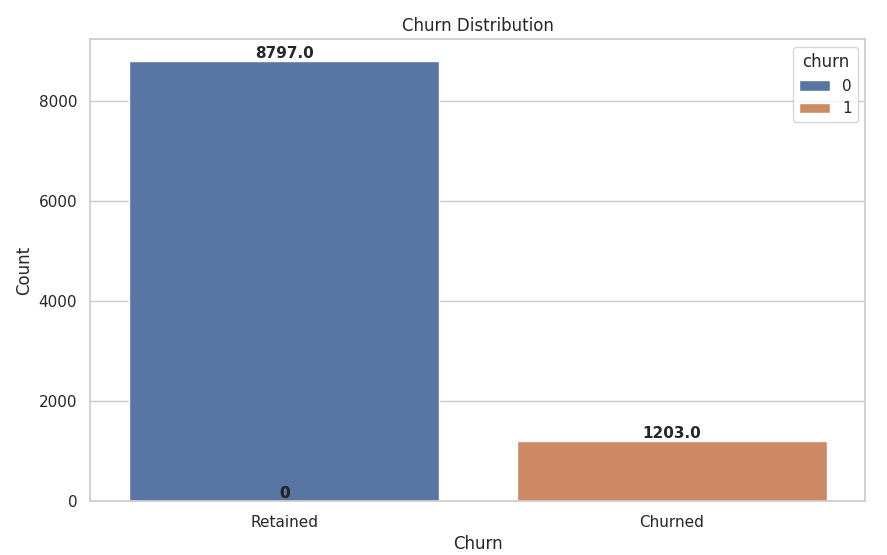
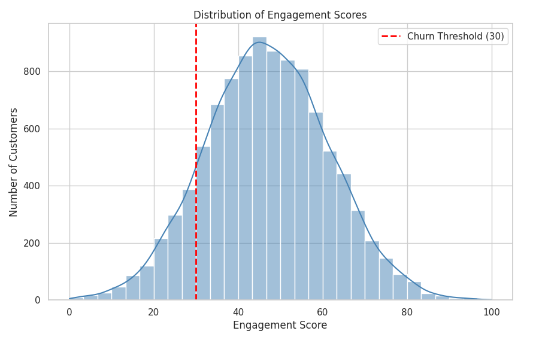
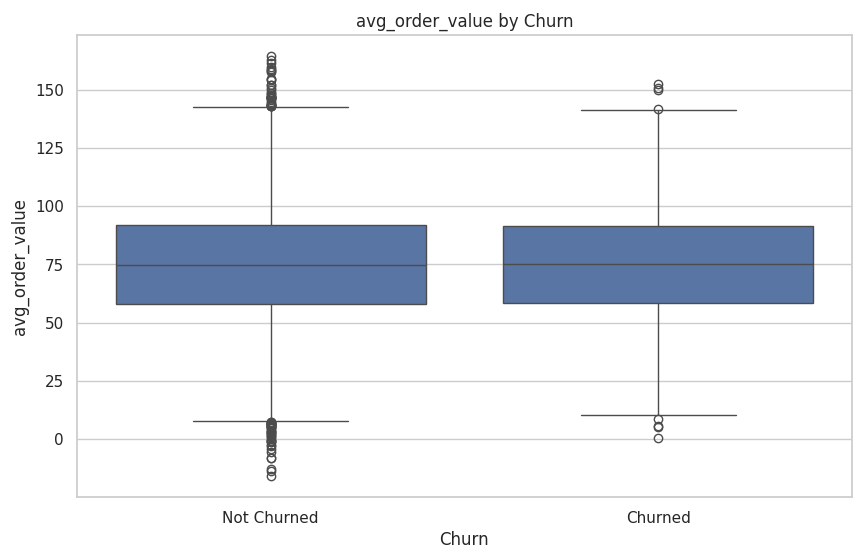
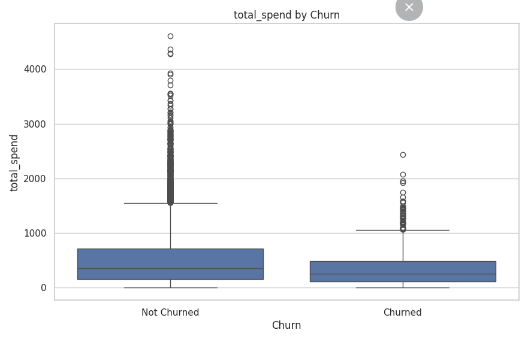
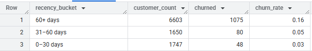
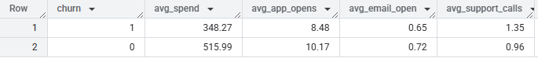
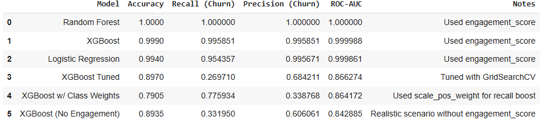
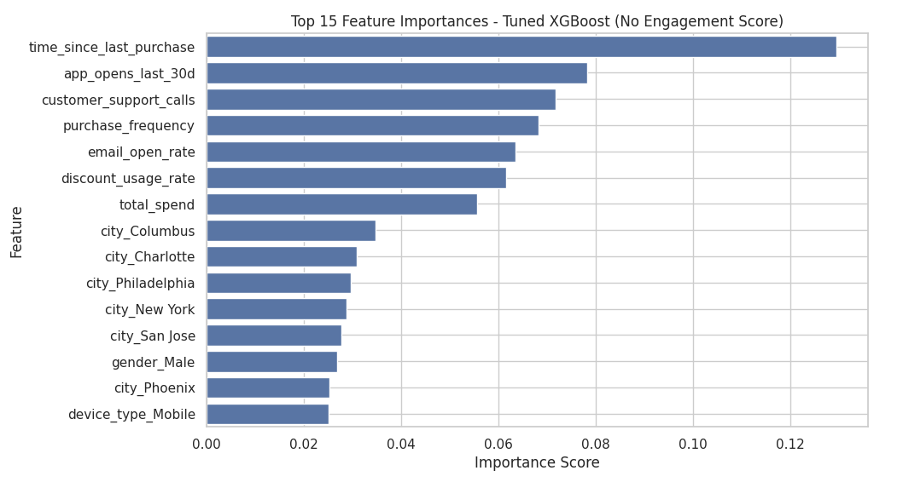

#  Churn_Machine_Learning

##  Table of Contents
- [Project Overview](#project-overview)
- [Executive Summary](#executive-summary)
- [Key Questions Answered](#key-questions-answered)
- [Tools Utilized](#tools-utilized)
- [Dataset Overview](#dataset-overview)
- [Exploratory Analysis](#exploratory-analysis)
- [Model Selection](#model-selection)
- [Recommendations](#recommendations)
- [Conclusion](#conclusion)
- [Additional Comments](#additional-comments)

---

##  Project Overview  
This project predicts **customer churn** using behavioral, demographic, and engagement data from **10,000 customer records**. Churn was defined using a behavior-based engagement score threshold. **SQL (BigQuery)** was used for feature extraction, **Python** for modeling, and **Power BI** for stakeholder dashboards.

Churn analysis supports key cross-functional goals:
- **Marketing**: Targeted re-engagement campaigns  
- **Product**: Identifying feature usage patterns to inform retention strategy  
- **Customer Success**: Proactive retention efforts based on churn signals

---

##  Executive Summary  
- Defined churn as **engagement score < 30** based on behavior and usage  
- Engineered predictive features: **purchase recency, app usage, email open rate**  
- Trained multiple models (**Logistic Regression, Random Forest, XGBoost**); tuned XGBoost achieved **89.7% accuracy** and **0.86 AUC**  
- Identified top churn predictors: **time since last purchase, app opens, purchase frequency**  
- Built a **Power BI dashboard** for risk segmentation and trend monitoring  

---

##  Key Questions Answered  
- What behaviors predict early customer churn?  
- Which users are high-value but disengaged?  
- How do recency and frequency affect churn probability?  
- Where should retention efforts be focused?  
- How can we operationalize churn scores for marketing and CX teams?

---

##  Tools Utilized  
- **SQL (Google BigQuery)** – Data exploration, segmentation, feature generation  
- **Python (Google Colab)** – Modeling, preprocessing, and evaluation  
- **Pandas, NumPy** – Data wrangling and transformation  
- **Seaborn, Matplotlib** – Visualizations for EDA and model insights  
- **Scikit-learn** – Preprocessing and baseline modeling  
- **XGBoost** – Final tuned model with class weighting and feature importance  
- **Power BI** – Final dashboard for business monitoring  

---

##  Dataset Overview  

10,000 customers are present in the dataset, with the following features:

###  Key Feature Groups  
- **Demographics**: `customer_id`, `age`, `gender`, `city`, `signup_days_ago`  
- **Behavioral Metrics**: `total_spend`, `avg_order_value`, `purchase_frequency`, `time_since_last_purchase`, `most_frequent_category`, `discount_usage_rate`, `customer_support_calls`, `device_type`, `preferred_purchase_time`  
- **Engagement Signals**: `app_opens_last_30d`, `email_open_rate`, `engagement_score`  
- **Target**: `churn` (binary; churned = 1, retained = 0)  

---

##  Exploratory Analysis  

**EDA** was performed using SQL and Python to surface key trends and inform feature engineering.

### 1. **Class Imbalance**  
~12% of users churned. To address this, `scale_pos_weight` was applied in XGBoost.  
 **

---

### 2. **Churn Definition (Engagement Score < 30)**  
Defined churn behaviorally using app usage, email interaction, and recency.  
 **

> **Why This Matters**: Enables early detection of disengaged users, allowing proactive outreach rather than reactive response.

---

### 3. **Feature Signals**  
Churners consistently had **lower engagement and spend**.  
 **  
 **  
 **

---

### 4. **Behavior Differences**  
Churn rate spiked after **60 days of inactivity** — validating recency as a top predictor.  
 **

---

### 5. **Support Signals**  
Frequent support calls and weak email engagement = churn risk  
 **

---

## Model Selection  
- **Train/Test Split**: 80/20 stratified  
- **Models Evaluated**: Logistic Regression, Random Forest, XGBoost  
- **Final Model**: Tuned XGBoost  
  - **Accuracy**: 89.7%  
  - **AUC**: 0.86  
  - **Note**: `engagement_score` excluded to prevent label leakage  

**  
**

---

## Recommendations  

- **Automated Outreach**: Trigger personalized messages after **30 days of inactivity**, with escalation at 45 days  
- **Low Engagement Segments**: Segment and re-engage users with **<20% email open rate**  
- **High Value, Low Activity**: Proactively retain high spenders showing drop in usage  
- **CRM Integration**: Push churn scores into tools like **Salesforce or HubSpot** for workflow automation  
- **Support Watchlist**: Flag accounts with **rising support activity** for human follow-up  

---

## Conclusion  
This full-cycle churn model provides a practical solution for identifying disengaged customers before they leave. The integration of behavioral signals, predictive modeling, and business-aligned recommendations makes this solution actionable across **marketing, product, and customer success** teams.

---

---

## Additional Comments
- To view the SQL code for the initial analysis, [click here.](https://github.com/amontaywelch/Churn_Machine_Learning/blob/main/churn_exploratory_analysis%20(1).sql)
- To view the full Python analysis + machine learning process, [click here.](https://github.com/amontaywelch/Churn_Machine_Learning/blob/main/Churn_Prediction_Final%20(2).ipynb)
- To view other projects, [click here.](https://amontaywelch.carrd.co/#)
- To view my LinkedIn, [click here](https://www.linkedin.com/in/amontay-welch/). Let's Connect!
