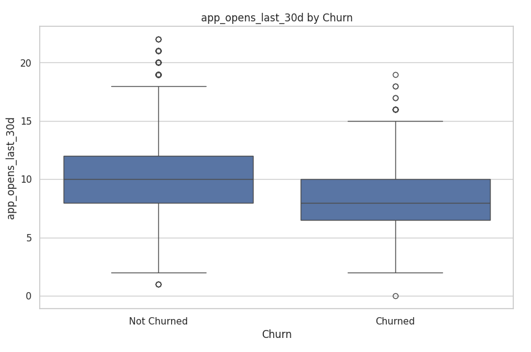

# Churn_Machine_Learning

Table of Contents

- [Project Overview](#project-overview)
- [Executive Summary](#executive-summary)
- [Key Questions Answered](#key-questions-answered)
- [Tools Utilized](#tools-utilized)
- [Dataset Overview](#dataset-overview)
- [Exploratory Analysis](#exploratory-analysis)
- [Model Selection](#model-selection)
- [Recommendations](#recommendations)
- [Conclusion](#conclusion)
- [Additional Comments](#additional-comments)

## Project Overview  
This project focuses on predicting customer churn using behavioral, demographic, and engagement data. Churn was defined using a combination of purchase inactivity and low engagement. SQL (BigQuery) was used to identify behavioral patterns, followed by feature engineering and predictive modeling in Python. Final insights were delivered through a Power BI dashboard to support business teams.

This project reflects how churn analysis supports cross-functional goals:

- **Marketing**: Re-engagement campaigns based on churn segments  
- **Product**: Feature usage patterns to inform retention strategy  
- **Customer Success**: Proactive outreach based on churn signals  

---

## Executive Summary  

- Defined churn as having an engagement score < 30 using behavioral data from 10,000 synthetic customer records  
- Conducted data exploration in BigQuery (SQL), followed by modeling in Python (scikit-learn, XGBoost)  
- Trained and evaluated multiple classifiers; tuned XGBoost achieved the best balance of precision and recall with 89.7% accuracy  
- Identified top churn predictors: time since last purchase, app usage, purchase frequency, and email engagement  
- Created feature importance visuals and ROC curves to support model interpretation  
- Built an interactive Power BI dashboard to monitor churn trends and inform retention strategies  

---

## Key Questions Answered  

- How do behaviors like app usage, time since last purchase, and email engagement signal early signs of churn?  
- What are the earliest detectable changes in customer activity before churn occurs?  
- Which customer segments—by spending, engagement, or usage—are most likely to churn?  
- Which engagement strategies (e.g. app opens, emails) are most strongly associated with retention?  
- Where can marketing and customer success teams focus their efforts to reduce churn and increase lifetime value?  

---

## Tools Utilized  

- **SQL (Google BigQuery)** – Data exploration, segmentation, feature generation  
- **Python (Google Colab)** – Modeling, preprocessing, and evaluation  
- **Pandas, NumPy** – Data wrangling and transformation  
- **Seaborn, Matplotlib** – Visualizations for EDA and model insights  
- **Scikit-learn** – Preprocessing and baseline modeling  
- **XGBoost** – Final tuned model with class weighting and feature importance  
- **Power BI** – Final dashboard for business monitoring  

---

## Dataset Overview  

Synthetic dataset of 10,000 customers reflecting realistic behavioral, engagement, and demographic patterns:

### Key Feature Groups
- **Demographics**: `customer_id`, `age`, `gender`, `city`, `signup_days_ago`  
- **Behavioral Metrics**: `total_spend`, `avg_order_value`, `purchase_frequency`, `time_since_last_purchase`, `most_frequent_category`, `discount_usage_rate`, `customer_support_calls`, `device_type`, `preferred_purchase_time`  
- **Engagement Signals**: `app_opens_last_30d`, `email_open_rate`, `engagement_score`  
- **Target**: `churn` (binary, defined as engagement_score < 30)  

---

## Exploratory Analysis  

EDA was performed using SQL and Python to surface insights and guide model development.

### 1. Churn Distribution & Class Imbalance  
Out of 10,000 customers, 1,203 were labeled as churned (12.03%), revealing a significant class imbalance in the dataset.  

Why This Matters:
Imbalanced datasets can bias machine learning models toward the majority class (retained customers), reducing their ability to detect churners. This was addressed in modeling using class weighting techniques (scale_pos_weight in XGBoost) to ensure the model prioritized recall on churn predictions.

### 2. Engagement Score & Churn Definition  
Churn was defined using an engagement score threshold of 30, based on behavior like app opens, email interaction, and purchase recency. 

Why This Matters:
Instead of relying on hard churn events (like account cancellation), this metric enables early detection of disengaged users. Defining churn this way helps the business act proactively, not reactively.

### 3. Behavior by Churn Status  
Churned users consistently showed lower engagement and spending across multiple behavioral dimensions. 
  
  

Why This Matters:
The data shows that churners are not only spending less but also engaging less frequently. Even users with high average order values may churn if their purchase frequency or app interaction drops, highlighting the importance of consistent engagement over time.

### 4. Recency Predicts Churn  
Churn rate increases dramatically as time since last purchase grows—highlighting recency as a key churn signal.  

Why This Matters:
The steep jump in churn after 60 days of inactivity validates recency as a top predictive feature. This finding directly shaped the model and should inform business re-engagement strategies (e.g., campaigns triggered after 30–45 days).

### 5. Communication & Support Patterns Reveal Churn Risk  
Churned users consistently showed weaker communication engagement and more frequent support issues than retained users.

Why This Matters:
Churners were less engaged across key communication channels and reached out to support more often—likely due to unresolved issues. These behavioral gaps provide early churn signals that can trigger proactive customer success outreach.

---

## Model Selection

The goal was to build a model that can accurately identify at-risk customers.

**Target:** `churn` (1 = churned, 0 = retained)  
**Train/Test Split:** 80/20 stratified  

### Preprocessing  
- Standardized numeric features  
- Encoded categorical variables  
- Addressed class imbalance using `scale_pos_weight` in XGBoost  

### Models Evaluated  

- **Final Model:** Tuned XGBoost (excluding `engagement_score` to prevent leakage)  
- **Top Predictors:** `time_since_last_purchase`, `app_opens_last_30d`, `purchase_frequency`, `email_open_rate`  

### Model Evaluation  
- Visualized with feature importance charts  
- ROC AUC = 0.86  

---

## Recommendations  

**Automated Re-Engagement After Inactivity**
- Implement lifecycle marketing automation that triggers personalized emails, app notifications, or offers after 30 days of inactivity, with a priority escalation at 45 days. Messaging should include loyalty incentives, product reminders, or surveys to re-capture attention before churn solidifies.

**Target Low Email Engagement with Win-Back Campaigns**
- Segment users with declining email open rates (<20%) into dedicated win-back flows. Use A/B testing to evaluate subject lines, send times, and promotional content tailored to behavior-based personas.

**Identify High-Value Users with Low Activity**
- Cross-reference high spenders or frequent purchasers who show reduced app interaction. Assign them to proactive customer success outreach, loyalty reward tiers, or exclusive feature previews to increase engagement and retention.

**Operationalize Churn Scores into CRM or CDP Tools**
- Integrate churn prediction scores into tools like Salesforce or HubSpot to help teams prioritize daily outreach. Configure workflows where a churn score > 0.75 prompts auto-flagging for human follow-up or triggered messaging sequences.

**Monitor Support Call Frequency for Retention Risk**
- Identify accounts with rising support interactions and match with sentiment tracking or resolution delays. Use this signal to surface pain points early and route customers to high-touch support or satisfaction follow-ups.

These strategies are designed to turn model insights into action across marketing, support, and product teams.

---

## Conclusion  
This project demonstrates the application of a full-cycle data science workflow to address customer churn, a critical business challenge. By integrating SQL-based exploration, engineered features, machine learning classification models, and interactive business dashboards, this solution offers a comprehensive framework for identifying and mitigating customer attrition.

Key behavioral signals—such as purchase recency, app usage, and communication patterns—were shown to strongly predict churn. The final model, a tuned XGBoost classifier, provided interpretable and high-performing churn predictions. Insights derived from this work were translated into strategic business recommendations designed to guide targeted retention initiatives across marketing, product, and customer success functions.

The approach is scalable, explainable, and business-aligned, making it suitable for real-world deployment and cross-functional collaboration.

---

## Additional Comments
- To view the SQL code for the initial analysis, [click here.](https://github.com/amontaywelch/Churn_Machine_Learning/blob/main/churn_exploratory_analysis%20(1).sql)
- To view the full Python analysis + machine learning process, [click here.](https://github.com/amontaywelch/Churn_Machine_Learning/blob/main/Churn_Prediction_Final%20(2).ipynb)
- To view other projects, [click here.](https://amontaywelch.carrd.co/#)
- To view my LinkedIn, [click here](https://www.linkedin.com/in/amontay-welch/). Let's Connect!
